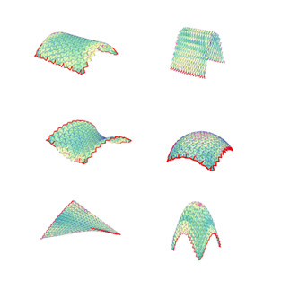
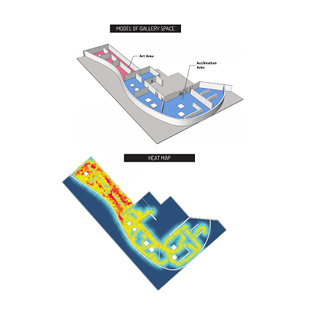
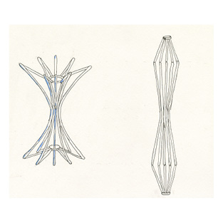
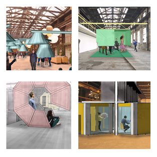

[PROJECTS](../projects.html)  /  [RESEARCH](./research)  /  [MAKING](../making)  /  [TEACHING](../courses.html) / [PUBLICATIONS](../publications.html) /  [CONTACT](../contact.html)

# R e s e a r c h

[Architectural Origami](#architectural-origami) | [Data Visualization](#vr-experiment) | [Bistable Mechanism](#bistability-in-architecture) | [Transformable Architecture](#transformable-architecture)

-----
### Architectural Origami
*2015 - 2016; Collaboration with LERA+*

The geometric flexibility of folded origami tessellations, combined with the structural efficiency of folded plate structures, gives origami strong potential for architectural and engineering applications.  This research explored this potential by examining the relationship between geometric parameters that define the fold pattern and the associated folded shape.  Visual scripting using Grasshopper in Rhino was used to digitally simulate folding of the flat patterns and to explore how the form of the folded tessellations can be adapted to various mathematical surfaces.  Structural analysis was performed in order  to gain an understanding of how variations in global geometric parameters, such as curvature and span, as well as variations in the crease pattern, such as pattern density, affect the strength and stability of the overall folded form on an architectural scale.

<iframe src='//gifs.com/embed/origami2-E87Y74' frameborder='0' scrolling='no' width='854px' height='458px' style='-webkit-backface-visibility: hidden;-webkit-transform: scale(1);' ></iframe>
-----
### VR Experiment
*2016 LERA*

The objective of this research was to demonstrate that virtual reality can be used as a tool for decision-making in the design process.  By allowing users to experience a proposed space in a virtual model, designers can collect user data to better understand the impact of architectural design features on human behavior.  With this information designers can make their designs more efficient and more responsive to their intended audience.

The goals of the experiment were to learn how participants inhabit a gallery space, discover the most common path of movement through a virtual gallery; 2) discover which pieces of artworks attract the most attention (either as a result of the spatial layout or aesthetic preference).

Two sets of data were collected for a total of 18 participants:
1.	Participant position recorded at 1 second intervals and reported as x, y coordinates relative to the global origin point shown in Figure below.
2.	Number of seconds each participant spent viewing each piece of artwork.  Participants were considered to be viewing a piece of artwork when they were within 6m of the artwork

This data was recorded in Unity, saved in Excel, and imported into Grasshopper for post-processing.  The goal was to visualize the data such that patterns in participant behavior emerge.  A heat map indicating most commonly traveled paths of users through the gallery was generated, as well as a graphic representation illustrating which paintings drew the most attention was generated by combining the normalized data and applying a value to each piece of artwork, indicating its “popularity.”

-----
### Bistability in Architecture
*2017; Collaboration with Ryan Haselman, Parsons School of Design*

Buildings are conceived as permanent-use structures, generally designed for a set function.  However, dynamic markets and fast-changing societies require new accommodation and usually buildings are deconstructed and rebuilt to suit new uses before the technical life cycle of the building materials has expired and thus they are not used to their fullest potential.  The solution is to anticipate the diversity of needs that are either dictated by the building’s users, or by the changing social and economic market, and to provide a design that can adapt to these evolving demands.  A flexible design not only increases the longevity of a building, but on a shorter timescale, enables the building to be multi-functional, serving a wider community of people.  This flexibility can be achieved by means of transformable structures which can change shape, volume, or appearance, subsequently impacting how a space is used or experienced.  In order to inspire a shift towards flexible design, the research seeks to expose the architectural “why” and the engineering “how” of transformable architecture by analyzing existing projects and exploring technical strategies for realizing transformable structures.  A qualitative evaluation of existing transformable architecture projects provides the context for experimenting with bistability as a potential mechanism for building transformable architecture.  Digital and physical modelling reveals limitations and opportunities associated with designing movable structures with this type of mechanism.

-----
### Transformable Architecture
*2015 Masters Thesis, Technical University of Delft*

As our cities continue to grow, making one building or facility useful to a larger number of people with a variety of needs becomes increasingly valuable.  Instead of relying on new construction to meet the needs of the growing population, can we reduce our consumption of resources by reusing the existing building stock and making each building useful for multiple functions?  How can we use transformable architecture to achieve this end?

The Van Gendt Hallen in Amsterdam are five landmark strutures covering and area of almost 13,000m2.  This project proposes four interventions which are designed to create small intimiate spaces within the large halls.  The structures are designed to be transformable in order to  give them the ability to adapt to the varying needs of different types of users by changing the space which they define.  Four transformable interventions are presented.

